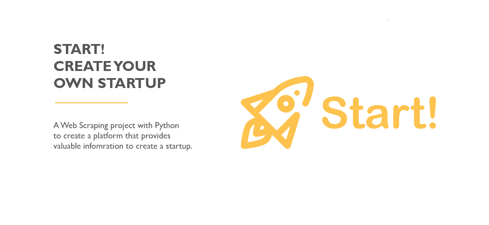

# Ironhack | Final Project - Start! The Platform to create your startup.  

## Overview

Web scraping is the process of extracting information from websites. In this project, Python is used to scrape valuable information from the internet and LinkedIn using two popular libraries, Beautiful Soup and Selenium. The goal is to provide entrepreneurs with information about where investors are investing, details about startups worldwide, and guidance on building an effective team.

## Procedure

To achieve this, Beautiful Soup is used to extract data from web pages, while Selenium is used to interact with the LinkedIn platform to extract information about individuals and companies. With the combination of these two libraries, the data can be extracted and analyzed to identify trends, patterns, and insights that can be useful for entrepreneurs looking to create a startup.

The platform provides information about where investors are investing, including details about their investment size, industry preferences, and location. The platform also provides detailed information about startups worldwide, including company profiles, funding details, and industry trends. In addition, the platform provides guidance on building an effective team, including identifying the right talent, creating a compelling job description, and developing a strong company culture.

Overall, this web scraping project provides valuable information and insights for entrepreneurs who are looking to create a startup, helping them to make informed decisions based on data and insights from the market.

## Steps

1. Collection of startup companies data with Beautiful Soup 
2. Collection of employee information with Selenium
3. Exploratory data analysis
4. Segment roles by department
5. Creation of presentation and dashboards in Tableau